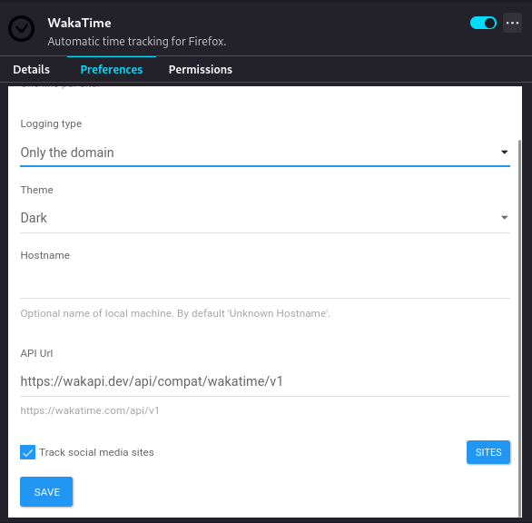

<p align="center">
  
</p>

<p align="center">
  
  <a href="https://liberapay.com/muety/"></a>
  
  
  <a href="https://goreportcard.com/report/github.com/muety/wakapi"></a>
  <a href="https://sonarcloud.io/dashboard?id=muety_wakapi"></a>
</p>

<h3 align="center">A minimalist, self-hosted WakaTime-compatible backend for coding statistics.</h3>

<div align="center">
  <h3>
    <a href="https://wakapi.dev">Website</a>
    <span> | </span>
    <a href="#-features">Features</a>
    <span> | </span>
    <a href="#%EF%B8%8F-how-to-use">How to use</a>
    <span> | </span>
    <a href="https://github.com/muety/wakapi/issues">Issues</a>
    <span> | </span>
    <a href="https://github.com/muety">Contact</a>
  </h3>
</div>

<p align="center">
  
</p>

> [!IMPORTANT]
> Upvote Wakapi on [AlternativeTo](https://alternativeto.net/software/wakapi/about/) and [ProductHunt](https://www.producthunt.com/posts/wakapi-coding-statistics) to support the project 🌈.

## 🚀 Features

* ✅ Free and open-source
* ✅ Built by developers for developers
* ✅ Statistics for projects, languages, editors, hosts and operating systems
* ✅ Badges
* ✅ Weekly E-Mail reports
* ✅ REST API
* ✅ Partially compatible with WakaTime
* ✅ WakaTime integration
* ✅ Support for Prometheus exports
* ✅ Lightning fast
* ✅ Self-hosted

## ⌨️ How to use?

There are different options for how to use Wakapi, ranging from our hosted cloud service to self-hosting it. Regardless of which option choose, you will always have to do the [client setup](#-client-setup) in addition.

### ☁️ Option 1: Use [wakapi.dev](https://wakapi.dev)

If you want to try out a free, hosted cloud service, all you need to do is create an account and then set up your client-side tooling (see below).

### 📦 Option 2: Quick-run a release

```bash
$ curl -L https://wakapi.dev/get | bash
```

**Alternatively** using [eget](https://github.com/zyedidia/eget):

```bash
$ eget muety/wakapi
```

### 🐳 Option 3: Use Docker

```bash
# Create a persistent volume
$ docker volume create wakapi-data

$ SALT="$(cat /dev/urandom | LC_ALL=C tr -dc 'a-zA-Z0-9' | fold -w ${1:-32} | head -n 1)"

# Run the container
$ docker run -d \
  --init \
  -p 3000:3000 \
  -e "WAKAPI_PASSWORD_SALT=$SALT" \
  -v wakapi-data:/data \
  --name wakapi \
  ghcr.io/muety/wakapi:latest
```

**Note:** By default, SQLite is used as a database. To run Wakapi in Docker with MySQL or Postgres, see [Dockerfile](https://github.com/muety/wakapi/blob/master/Dockerfile) and [config.default.yml](https://github.com/muety/wakapi/blob/master/config.default.yml) for further options.

If you want to run Wakapi on **Kubernetes**, there is [wakapi-helm-chart](https://github.com/ricristian/wakapi-helm-chart) for quick and easy deployment.

#### Docker Compose

Alternatively, you can use Docker Compose for an even more straightforward deployment. See [compose.yml](https://github.com/muety/wakapi/blob/master/compose.yml) for configuration details.

Wakapi supports [Docker Secrets](https://docs.docker.com/compose/how-tos/use-secrets/) for the following variables: `WAKAPI_PASSWORD_SALT`, `WAKAPI_DB_PASSWORD`, `WAKAPI_MAIL_SMTP_PASS`. You can set these either by having them mounted as a secret file, or directly pass them as environment variables.

##### Example

```bash
export WAKAPI_PASSWORD_SALT=changeme
export WAKAPI_DB_PASSWORD=changeme
export WAKAPI_MAIL_SMTP_PASS=changeme

docker compose up -d
```

If you prefer to persist data in a local directory while using SQLite as the database, make sure to set the correct `user` option in the Docker Compose configuration to avoid permission issues.

### 🧑‍💻 Option 4: Compile and run from source

```bash
# Build and install
# Alternatively: go build -o wakapi
$ go install github.com/muety/wakapi@latest

# Get default config and customize
$ curl -o wakapi.yml https://raw.githubusercontent.com/muety/wakapi/master/config.default.yml
$ vi wakapi.yml

# Run it
$ ./wakapi -config wakapi.yml
```

**Note:** Check the comments in `config.yml` for best practices regarding security configuration and more.

💡 When running Wakapi standalone (without Docker), it is recommended to run it as a [SystemD service](etc/wakapi.service).

### 💻 Client setup

Wakapi relies on the open-source [WakaTime](https://github.com/wakatime/wakatime-cli) client tools. In order to collect statistics for Wakapi, you need to set them up.

1. **Set up WakaTime** for your specific IDE or editor. Please refer to the respective [plugin guide](https://wakatime.com/plugins)
2. **Edit your local `~/.wakatime.cfg`** file as follows.

```ini
[settings]

# Your Wakapi server URL or 'https://wakapi.dev/api' when using the cloud server
api_url = http://localhost:3000/api

# Your Wakapi API key (get it from the web interface after having created an account)
api_key = 406fe41f-6d69-4183-a4cc-121e0c524c2b
```

Optionally, you can set up a [client-side proxy](https://github.com/muety/wakapi/wiki/Advanced-Setup:-Client-side-proxy) in addition.

## 🔧 Configuration options

You can specify configuration options either via a config file (default: `config.yml`, customizable through the `-c` argument) or via environment variables. Here is an overview of all options.

| YAML key / Env. variable                                                                    | Default                                          | Description                                                                                                                                                                     |
|---------------------------------------------------------------------------------------------|--------------------------------------------------|---------------------------------------------------------------------------------------------------------------------------------------------------------------------------------|
| `env` /<br>`ENVIRONMENT`                                                                    | `dev`                                            | Whether to use development- or production settings                                                                                                                              |
| `app.leaderboard_enabled` /<br>`WAKAPI_LEADERBOARD_ENABLED`                                 | `true`                                           | Whether to enable the public leaderboard                                                                                                                                        |
| `app.leaderboard_scope` /<br>`WAKAPI_LEADERBOARD_SCOPE`                                     | `7_days`                                         | Aggregation interval for public leaderboard (see [here](https://github.com/muety/wakapi/blob/7d156cd3edeb93af2997bd95f12933b0aabef0c9/config/config.go#L71) for allowed values) |
| `app.leaderboard_generation_time` /<br>`WAKAPI_LEADERBOARD_GENERATION_TIME`                 | `0 0 6 * * *,0 0 18 * * *`                       | One or multiple times of day at which to re-calculate the leaderboard                                                                                                           |
| `app.leaderboard_require_auth` /<br>`WAKAPI_LEADERBOARD_REQUIRE_AUTH`                       | `false`                                          | Restrict leaderboard access to logged in users only                                                                                                                             |
| `app.aggregation_time` /<br>`WAKAPI_AGGREGATION_TIME`                                       | `0 15 2 * * *`                                   | Time of day at which to periodically run summary generation for all users                                                                                                       |
| `app.report_time_weekly` /<br>`WAKAPI_REPORT_TIME_WEEKLY`                                   | `0 0 18 * * 5`                                   | Week day and time at which to send e-mail reports                                                                                                                               |
| `app.data_cleanup_time` /<br>`WAKAPI_DATA_CLEANUP_TIME`                                     | `0 0 6 * * 0`                                    | When to perform data cleanup operations (see `app.data_retention_months`)                                                                                                       |
| `app.optimize_database_time` /<br>`WAKAPI_OPTIMIZE_DATABASE_TIME`                           | `0 0 8 1 * *`                                    | When to perform database vacuuming (SQLite, Postgres) or table optimization (MySQL)                                                                                             |
| `app.import_enabled` /<br>`WAKAPI_IMPORT_ENABLED`                                           | `true`                                           | Whether data imports from WakaTime or other Wakapi instances are permitted                                                                                                      |
| `app.import_batch_size` /<br>`WAKAPI_IMPORT_BATCH_SIZE`                                     | `50`                                             | Size of batches of heartbeats to insert to the database during importing from external services                                                                                 |
| `app.import_backoff_min` /<br>`WAKAPI_IMPORT_BACKOFF_MIN`                                   | `5`                                              | "Cooldown" period in minutes before user may attempt another data import                                                                                                        |
| `app.import_max_rate` /<br>`WAKAPI_IMPORT_MAX_RATE`                                         | `24`                                             | Minimum number of hours to wait after a successful data import before user may attempt another one                                                                              |
| `app.inactive_days` /<br>`WAKAPI_INACTIVE_DAYS`                                             | `7`                                              | Number of days after which to consider a user inactive (only for metrics)                                                                                                       |
| `app.heartbeat_max_age /`<br>`WAKAPI_HEARTBEAT_MAX_AGE`                                     | `4320h`                                          | Maximum acceptable age of a heartbeat (see [`ParseDuration`](https://pkg.go.dev/time#ParseDuration))                                                                            |
| `app.warm_caches /`<br>`WAKAPI_WARM_CACHES`                                                 | `true`                                           | Whether to perform some initial cache warming upon startup                                                                                                                      |
| `app.custom_languages`                                                                      | -                                                | Map from file endings to language names                                                                                                                                         |
| `app.avatar_url_template` /<br>`WAKAPI_AVATAR_URL_TEMPLATE`                                 | (see [`config.default.yml`](config.default.yml)) | URL template for external user avatar images (e.g. from [Dicebear](https://dicebear.com) or [Gravatar](https://gravatar.com))                                                   |
| `app.date_format` /<br>`WAKAPI_DATE_FORMAT`                                                 | `Mon, 02 Jan 2006`                               | Go time format strings to format human-readable date (see [`Time.Format`](https://pkg.go.dev/time#Time.Format))                                                                 |
| `app.datetime_format` /<br>`WAKAPI_DATETIME_FORMAT`                                         | `Mon, 02 Jan 2006 15:04`                         | Go time format strings to format human-readable datetime (see [`Time.Format`](https://pkg.go.dev/time#Time.Format))                                                             |
| `app.support_contact` /<br>`WAKAPI_SUPPORT_CONTACT`                                         | `hostmaster@wakapi.dev`                          | E-Mail address to display as a support contact on the page                                                                                                                      |
| `app.data_retention_months` /<br>`WAKAPI_DATA_RETENTION_MONTHS`                             | `-1`                                             | Maximum retention period in months for user data (heartbeats) (-1 for unlimited)                                                                                                |
| `app.max_inactive_months` /<br>`WAKAPI_MAX_INACTIVE_MONTHS`                                 | `12`                                             | Maximum number of inactive months after which to delete user accounts without data (-1 for unlimited)                                                                           |
| `server.port` /<br> `WAKAPI_PORT`                                                           | `3000`                                           | Port to listen on                                                                                                                                                               |
| `server.listen_ipv4` /<br> `WAKAPI_LISTEN_IPV4`                                             | `127.0.0.1`                                      | IPv4 network address to listen on (set to `'-'` to disable IPv4)                                                                                                                |
| `server.listen_ipv6` /<br> `WAKAPI_LISTEN_IPV6`                                             | `::1`                                            | IPv6 network address to listen on (set to `'-'` to disable IPv6)                                                                                                                |
| `server.listen_socket` /<br> `WAKAPI_LISTEN_SOCKET`                                         | -                                                | UNIX socket to listen on (set to `'-'` to disable UNIX socket)                                                                                                                  |
| `server.listen_socket_mode` /<br> `WAKAPI_LISTEN_SOCKET_MODE`                               | `0666`                                           | Permission mode to create UNIX socket with                                                                                                                                      |
| `server.timeout_sec` /<br> `WAKAPI_TIMEOUT_SEC`                                             | `30`                                             | Request timeout in seconds                                                                                                                                                      |
| `server.tls_cert_path` /<br> `WAKAPI_TLS_CERT_PATH`                                         | -                                                | Path of SSL server certificate (leave blank to not use HTTPS)                                                                                                                   |
| `server.tls_key_path` /<br> `WAKAPI_TLS_KEY_PATH`                                           | -                                                | Path of SSL server private key (leave blank to not use HTTPS)                                                                                                                   |
| `server.base_path` /<br> `WAKAPI_BASE_PATH`                                                 | `/`                                              | Web base path (change when running behind a proxy under a sub-path)                                                                                                             |
| `server.public_url` /<br> `WAKAPI_PUBLIC_URL`                                               | `http://localhost:3000`                          | URL at which your Wakapi instance can be found publicly                                                                                                                         |
| `security.password_salt` /<br> `WAKAPI_PASSWORD_SALT`                                       | -                                                | Pepper to use for password hashing                                                                                                                                              |
| `security.insecure_cookies` /<br> `WAKAPI_INSECURE_COOKIES`                                 | `true`                                           | Whether or not to allow cookies over HTTP. For production, it is **highly recommended** to serve Wakapi via HTTPS and set this to `false`.                                      |
| `security.cookie_max_age` /<br> `WAKAPI_COOKIE_MAX_AGE`                                     | `172800`                                         | Lifetime of authentication cookies in seconds or `0` to use [Session](https://developer.mozilla.org/en-US/docs/Web/HTTP/Cookies#Define_the_lifetime_of_a_cookie) cookies        |
| `security.allow_signup` /<br> `WAKAPI_ALLOW_SIGNUP`                                         | `true`                                           | Whether to enable user registration                                                                                                                                             |
| `security.signup_captcha` /<br> `WAKAPI_SIGNUP_CAPTCHA`                                     | `false`                                          | Whether the registration form requires solving a CAPTCHA                                                                                                                        |
| `security.invite_codes` /<br> `WAKAPI_INVITE_CODES`                                         | `true`                                           | Whether to enable registration by invite codes. Primarily useful if registration is disabled (invite-only server).                                                              |
| `security.disable_frontpage` /<br> `WAKAPI_DISABLE_FRONTPAGE`                               | `false`                                          | Whether to disable landing page (useful for personal instances)                                                                                                                 |
| `security.expose_metrics` /<br> `WAKAPI_EXPOSE_METRICS`                                     | `false`                                          | Whether to expose Prometheus metrics under `/api/metrics`                                                                                                                       |
| `security.trusted_header_auth` /<br> `WAKAPI_TRUSTED_HEADER_AUTH`                           | `false`                                          | Whether to enable trusted header authentication for reverse proxies (see [#534](https://github.com/muety/wakapi/issues/534)). **Use with caution!**                             |
| `security.trusted_header_auth_key` /<br> `WAKAPI_TRUSTED_HEADER_AUTH_KEY`                   | `Remote-User`                                    | Header field for trusted header authentication. **Caution:** proxy must be configured to strip this header from client requests!                                                |
| `security.trusted_header_auth_allow_signup` /<br> `WAKAPI_TRUSTED_HEADER_AUTH_ALLOW_SIGNUP` | `false`                                          | Whether to allow creation of new users based on upstream trusted header authentication (see [#808](https://github.com/muety/wakapi/issues/808))                                 |
| `security.trust_reverse_proxy_ips` /<br> `WAKAPI_TRUST_REVERSE_PROXY_IPS`                   | -                                                | Comma-separated list of IPv4 or IPv6 addresses or CIDRs of reverse proxies to trust to handle authentication (e.g. `172.17.0.1`, `192.168.0.0/24`, `[::1]`).                    |
| `security.signup_max_rate` /<br> `WAKAPI_SIGNUP_MAX_RATE`                                   | `5/1h`                                           | Rate limiting config for signup endpoint in format `<max_req>/<multiplier><unit>`, where `unit` is one of `s`, `m` or `h`.                                                      |
| `security.login_max_rate` /<br> `WAKAPI_LOGIN_MAX_RATE`                                     | `10/1m`                                          | Rate limiting config for login endpoint in format `<max_req>/<multiplier><unit>`, where `unit` is one of `s`, `m` or `h`.                                                       |
| `security.password_reset_max_rate` /<br> `WAKAPI_PASSWORD_RESET_MAX_RATE`                   | `5/1h`                                           | Rate limiting config for password reset endpoint in format `<max_req>/<multiplier><unit>`, where `unit` is one of `s`, `m` or `h`.                                              |
| `security.oidc`                                                                             | `[]`                                             | List of OpenID Connect provider configurations (for details, see [wiki](https://github.com/muety/wakapi/wiki/OpenID-Connect-login-(SSO)))                                       |
| `security.oidc[0].name` /<br> `WAKAPI_OIDC_PROVIDERS_0_NAME`                                | -                                                | Name / identifier for the OpenID Connect provider (e.g. `gitlab`)                                                                                                               |
| `security.oidc[0].display_name` /<br> `WAKAPI_OIDC_PROVIDERS_0_DISPLAY_NAME`                | -                                                | Optional "human-readable" display name for the provider presented to the user                                                                                                   |
| `security.oidc[0].client_id` /<br> `WAKAPI_OIDC_PROVIDERS_0_CLIENT_ID`                      | -                                                | OAuth client name with this provider                                                                                                                                            |
| `security.oidc[0].client_secret` /<br> `WAKAPI_OIDC_PROVIDERS_0_CLIENT_SECRET`              | -                                                | OAuth client secret with this provider                                                                                                                                          |
| `security.oidc[0].endpoint` /<br> `WAKAPI_OIDC_PROVIDERS_0_ENDPOINT`                        | -                                                | OpenID Connect provider API entrypoint (for [discovery](https://openid.net/specs/openid-connect-discovery-1_0.html))                                                            |
| `db.host` /<br> `WAKAPI_DB_HOST`                                                            | -                                                | Database host                                                                                                                                                                   |
| `db.port` /<br> `WAKAPI_DB_PORT`                                                            | -                                                | Database port                                                                                                                                                                   |
| `db.socket` /<br> `WAKAPI_DB_SOCKET`                                                        | -                                                | Database UNIX socket (alternative to `host`) (for MySQL only)                                                                                                                   |
| `db.user` /<br> `WAKAPI_DB_USER`                                                            | -                                                | Database user                                                                                                                                                                   |
| `db.password` /<br> `WAKAPI_DB_PASSWORD`                                                    | -                                                | Database password                                                                                                                                                               |
| `db.name` /<br> `WAKAPI_DB_NAME`                                                            | `wakapi_db.db`                                   | Database name                                                                                                                                                                   |
| `db.dialect` /<br> `WAKAPI_DB_TYPE`                                                         | `sqlite3`                                        | Database type (one of `sqlite3`, `mysql`, `postgres`)                                                                                                                           |
| `db.charset` /<br> `WAKAPI_DB_CHARSET`                                                      | `utf8mb4`                                        | Database connection charset (for MySQL only)                                                                                                                                    |
| `db.max_conn` /<br> `WAKAPI_DB_MAX_CONNECTIONS`                                             | `2`                                              | Maximum number of database connections                                                                                                                                          |
| `db.ssl` /<br> `WAKAPI_DB_SSL`                                                              | `false`                                          | Whether to use TLS encryption for database connection (Postgres only)                                                                                                           |
| `db.compress` /<br> `WAKAPI_DB_COMPRESS`                                                    | `false`                                          | Whether to enable compression for database connection (MySQL only)                                                                                                              |
| `db.automgirate_fail_silently` /<br> `WAKAPI_DB_AUTOMIGRATE_FAIL_SILENTLY`                  | `false`                                          | Whether to ignore schema auto-migration failures when starting up                                                                                                               |
| `mail.enabled` /<br> `WAKAPI_MAIL_ENABLED`                                                  | `false`                                          | Whether to allow Wakapi to send e-mail (e.g. for password resets)                                                                                                               |
| `mail.sender` /<br> `WAKAPI_MAIL_SENDER`                                                    | -                                                | Default sender address for outgoing mails                                                                                                                                       |
| `mail.skip_verify_mx_record` /<br> `WAKAPI_MAIL_SKIP_VERIFY_MX_RECORD`                      | `false`                                          | Whether to skip validating MX DNS record for user email addresses                                                                                                               |
| `mail.provider` /<br> `WAKAPI_MAIL_PROVIDER`                                                | `smtp`                                           | Implementation to use for sending mails (one of [`smtp`])                                                                                                                       |
| `mail.smtp.host` /<br> `WAKAPI_MAIL_SMTP_HOST`                                              | -                                                | SMTP server address for sending mail (if using `smtp` mail provider)                                                                                                            |
| `mail.smtp.port` /<br> `WAKAPI_MAIL_SMTP_PORT`                                              | -                                                | SMTP server port (usually 465)                                                                                                                                                  |
| `mail.smtp.username` /<br> `WAKAPI_MAIL_SMTP_USER`                                          | -                                                | SMTP server authentication username                                                                                                                                             |
| `mail.smtp.password` /<br> `WAKAPI_MAIL_SMTP_PASS`                                          | -                                                | SMTP server authentication password                                                                                                                                             |
| `mail.smtp.tls` /<br> `WAKAPI_MAIL_SMTP_TLS`                                                | `false`                                          | Whether the SMTP server requires TLS encryption (`false` for STARTTLS or no encryption)                                                                                         |
| `mail.smtp.skip_verify` /<br> `WAKAPI_MAIL_SMTP_SKIP_VERIFY`                                | `false`                                          | Whether to allow invalid or self-signed certificates for TLS-encrypted SMTP                                                                                                     |
| `sentry.dsn` /<br> `WAKAPI_SENTRY_DSN`                                                      | –                                                | DSN for to integrate [Sentry](https://sentry.io) for error logging and tracing (leave empty to disable)                                                                         |
| `sentry.environment` /<br> `WAKAPI_SENTRY_ENVIRONMENT`                                      | (`env`)                                          | Sentry [environment](https://docs.sentry.io/concepts/key-terms/environments/) tag (defaults to `env` / `ENV`)                                                                   |
| `sentry.enable_tracing` /<br> `WAKAPI_SENTRY_TRACING`                                       | `false`                                          | Whether to enable Sentry request tracing                                                                                                                                        |
| `sentry.sample_rate` /<br> `WAKAPI_SENTRY_SAMPLE_RATE`                                      | `0.75`                                           | Probability of tracing a request in Sentry                                                                                                                                      |
| `sentry.sample_rate_heartbeats` /<br> `WAKAPI_SENTRY_SAMPLE_RATE_HEARTBEATS`                | `0.1`                                            | Probability of tracing a heartbeat request in Sentry                                                                                                                            |
| `quick_start` /<br> `WAKAPI_QUICK_START`                                                    | `false`                                          | Whether to skip initial boot tasks. Use only for development purposes!                                                                                                          |
| `enable_pprof` /<br> `WAKAPI_ENABLE_PPROF`                                                  | `false`                                          | Whether to expose [pprof](https://pkg.go.dev/runtime/pprof) profiling data as an endpoint for debugging                                                                         |

### Supported databases

Wakapi uses [GORM](https://gorm.io) as an ORM. As a consequence, a set of different relational databases is supported.

* [SQLite](https://sqlite.org/) (_default, easy setup_)
* [MySQL](https://hub.docker.com/_/mysql) (_recommended, because most extensively tested_)
* [MariaDB](https://hub.docker.com/_/mariadb) (_open-source MySQL alternative_)
* [Postgres](https://hub.docker.com/_/postgres) (_open-source as well_)

## 🔐 Authentication

Wakapi supports different types of user authentication.

* **Cookie:** This method is used in the browser. Users authenticate by sending along an encrypted, secure, HTTP-only cookie (`wakapi_auth`) that was set in the server's response upon login.
* **API key:**
    * **Via header:** This method is inspired by [WakaTime's auth. mechanism](https://wakatime.com/developers/#authentication) and is the common way to authenticate against API endpoints. Users set the `Authorization` header to `Basic <BASE64_TOKEN>`, where the latter part corresponds to your base64-hashed API key.
    * **Vis query param:** Alternatively, users can also pass their plain API key as a query parameter (e.g. `?api_key=86648d74-19c5-452b-ba01-fb3ec70d4c2f`) in the URL with every request.
* **Trusted header:** This mechanism allows to delegate authentication to a **reverse proxy** (e.g. for SSO), that Wakapi will then trust blindly. See [#534](https://github.com/muety/wakapi/issues/534) for details.
    * Must be enabled via `trusted_header_auth` and configuring `trust_reverse_proxy_ip` in the config
    * Warning: This type of authentication is quite prone to misconfiguration. Make sure that your reverse proxy properly strips relevant headers from client requests.

### Single Sign-On / OpenID Connect

Wakapi supports login via external identity providers via OpenID Connect. See [our wiki](https://github.com/muety/wakapi/wiki/OpenID-Connect-login-(SSO)) for details.

## 🔧 API endpoints

See our [Swagger API Documentation](https://wakapi.dev/swagger-ui).

### Generating Swagger docs

```bash
$ go install github.com/swaggo/swag/cmd/swag@latest
$ swag init -o static/docs
```

## 🤝 Integrations

### Prometheus export

You can export your Wakapi statistics to Prometheus to view them in a Grafana dashboard or so. Here is how.

```bash
# 1. Start Wakapi with the feature enabled
$ export WAKAPI_EXPOSE_METRICS=true
$ ./wakapi

# 2. Get your API key and hash it
$ echo "<YOUR_API_KEY>" | base64

# 3. Add a Prometheus scrape config to your prometheus.yml (see below)
```

#### Scrape config example

```yml
# prometheus.yml
# (assuming your Wakapi instance listens at localhost, port 3000)

scrape_configs:
  - job_name: 'wakapi'
    scrape_interval: 1m
    metrics_path: '/api/metrics'
    bearer_token: '<YOUR_BASE64_HASHED_TOKEN>'
    static_configs:
      - targets: [ 'localhost:3000' ]
```

#### Grafana

There is also a [nice Grafana dashboard](https://grafana.com/grafana/dashboards/12790), provided by the author of [wakatime_exporter](https://github.com/MacroPower/wakatime_exporter).


### WakaTime integration

Wakapi plays well together with [WakaTime](https://wakatime.com). For one thing, you can **forward heartbeats** from Wakapi to WakaTime to effectively use both services simultaneously. In addition, there is the option to **import historic data** from WakaTime for consistency between both services. Both features can be enabled in the _Integrations_ section of your Wakapi instance's settings page.

### GitHub Readme Stats integrations

Wakapi also integrates with [GitHub Readme Stats](https://github.com/anuraghazra/github-readme-stats#wakatime-week-stats) to generate fancy cards for you. Here is an example. To use this, don't forget to **enable public data** under [Settings -> Permissions](https://wakapi.dev/settings#permissions).

<details>
<summary>Click to view code</summary>

```markdown

```

</details>
<br>

### GitHub Readme Metrics integration

There is a [WakaTime plugin](https://github.com/lowlighter/metrics/tree/master/source/plugins/wakatime) for GitHub [Metrics](https://github.com/lowlighter/metrics/) that is also compatible with Wakapi. To use this, don't forget to **enable public data** under [Settings -> Permissions](https://wakapi.dev/settings#permissions).

Preview:


<details>
<summary>Click to view code</summary>

```yml
- uses: lowlighter/metrics@latest
  with:
    # ... other options
    plugin_wakatime: yes
    plugin_wakatime_token: ${{ secrets.WAKATIME_TOKEN }}      # Required
    plugin_wakatime_days: 7                                   # Display last week stats
    plugin_wakatime_sections: time, projects, projects-graphs # Display time and projects sections, along with projects graphs
    plugin_wakatime_limit: 4                                  # Show 4 entries per graph
    plugin_wakatime_url: http://wakapi.dev                    # Wakatime url endpoint
    plugin_wakatime_user: .user.login                         # User

```

</details>
<br>

### Browser Plugin (Chrome & Firefox)

The [browser-wakatime](https://github.com/wakatime/browser-wakatime) plugin enables you to track your web surfing in WakaTime (and Wakapi, of course). Visited websites will appear as "files" in the summary. Follow these instructions to get started:

1. Install the browser extension from the official store ([Firefox](https://addons.mozilla.org/en-US/firefox/addon/wakatimes), [Chrome](https://chrome.google.com/webstore/detail/wakatime/jnbbnacmeggbgdjgaoojpmhdlkkpblgi?hl=de))
2. Open the extension settings dialog
3. Configure it like so (see screenshot below):
    * API Key: Your personal API key (get it at [wakapi.dev](https://wakapi.dev))
    * Logging Type: _Only the domain_
    * API URL: `https://wakapi.dev/api/compat/wakatime/v1` (alternatively, replace _wakapi.dev_ with your self-hosted instance hostname)
4. Save
5. Start browsing!



Note: the plugin will only sync heartbeats once in a while, so it might take some time for them to appear on Wakapi. To "force" it to sync, simply bring up the plugin main dialog.

### Gnome Extension

If you're using the GNOME desktop, there is a quick way to display your today's coding statistics in the status bar.


Simply install the [Executor](https://extensions.gnome.org/extension/2932/executor/) extension and add the following command as a status bar indicator:

```bash
~/.wakatime/wakatime-cli-linux-amd64 --today
```

## 📦 Data Export

You can export your coding activity from Wakapi to CSV in the form of raw heartbeats. While there is no way to achieve this directly through the web UI, we provide an easy-to-use Python [script](scripts/download_heartbeats.py)
instead.

```bash
$ pip install requests tqdm
$ python scripts/download_heartbeats.py --api_key API_KEY [--url URL] [--from FROM] [--to TO] [--output OUTPUT]
```

<details>

<summary>Example</summary>

```bash
python scripts/download_heartbeats.py --api_key 04648d14-15c9-432b-b901-dbeec70d4eaf \
  --url https://wakapi.dev/api \
  --from 2023-01-01 \
  --to 2023-01-31 \
  --output wakapi_export.csv
```

</details>

## 👍 Best practices

It is recommended to use wakapi behind a **reverse proxy**, like [Caddy](https://caddyserver.com) or [nginx](https://www.nginx.com/), to enable **TLS encryption** (HTTPS).

However, if you want to expose your wakapi instance to the public anyway, you need to set `server.listen_ipv4` to `0.0.0.0` in `config.yml`.

## 🧪 Tests

### Unit tests

Unit tests are supposed to test business logic on a fine-grained level. They are implemented as part of the application, using Go's [testing](https://pkg.go.dev/testing?utm_source=godoc) package alongside [stretchr/testify](https://pkg.go.dev/github.com/stretchr/testify).

#### How to run

```bash
$ go install github.com/mfridman/tparse@latest  # optional
$ CGO_ENABLED=0 go test -json -coverprofile=coverage/coverage.out ./... -run ./... | tparse -all
```

### API tests

API tests are implemented as black box tests, which interact with a fully-fledged, standalone Wakapi through HTTP requests. They are supposed to check Wakapi's web stack and endpoints, including response codes, headers and data on a syntactical level, rather than checking the actual content that is returned.

Our API (or end-to-end, in some way) tests are implemented as a [Bruno](https://www.usebruno.com/) collection and can be run either from inside Bruno, or using [Bruno CLI](https://www.npmjs.com/package/@usebruno/cli) as a command-line runner.

To get a predictable environment, tests are run against a fresh and clean Wakapi instance with a SQLite database that is populated with nothing but some seed data (see [data.sql](testing/data.sql)). It is usually recommended for software tests to be [safe](https://www.restapitutorial.com/lessons/idempotency.html), stateless and without side effects. In contrary to that paradigm, our API tests strictly require a fixed execution order (which Bruno assures) and their assertions may rely on specific previous tests having succeeded.

#### Prerequisites (Linux only)

```bash
# 1. sqlite (cli)
$ sudo apt install sqlite  # Fedora: sudo dnf install sqlite

# 2. bruno cli
$ npm install -g @usebruno/cli
```

#### How to run (Linux only)

```bash
$ ./testing/run_api_tests.sh
```

## 🤓 Developer notes

### Building web assets

To keep things minimal, all JS and CSS assets are included as static files and checked in to Git. [TailwindCSS](https://tailwindcss.com/docs/installation#building-for-production) and [Iconify](https://iconify.design/docs/icon-bundles/) require an additional build step. To only require this at the time of development, the compiled assets are checked in to Git as well.

```bash
$ yarn
$ yarn build  # or: yarn watch
```

New icons can be added by editing the `icons` array in [scripts/bundle_icons.js](scripts/bundle_icons.js).

#### Precompression

As explained in [#284](https://github.com/muety/wakapi/issues/284), precompressed (using Brotli) versions of some of the assets are delivered to save additional bandwidth. This was inspired by Caddy's [`precompressed`](https://caddyserver.com/docs/caddyfile/directives/file_server) directive. [`gzipped.FileServer`](https://github.com/muety/wakapi/blob/07a367ce0a97c7738ba8e255e9c72df273fd43a3/main.go#L249) checks for every static file's `.br` or `.gz` equivalents and, if present, delivers those instead of the actual file, alongside `Content-Encoding: br`. Currently, compressed assets are simply checked in to Git. Later we might want to have this be part of a new build step.

To pre-compress files, run this:

```bash
# Install brotli first
$ sudo apt install brotli  # or: sudo dnf install brotli

# Watch, build and compress
$ yarn watch:compress

# Alternatively: build and compress only
$ yarn build:all:compress

# Alternatively: compress only
$ yarn compress
```

## ❔ FAQs

Since Wakapi heavily relies on the concepts provided by WakaTime, [their FAQs](https://wakatime.com/faq) largely apply to Wakapi as well. You might find answers there.

<details>
<summary><b>What data are sent to Wakapi?</b></summary>

<ul>
  <li>File names</li>
  <li>Project names</li>
  <li>Editor names</li>
  <li>Your computer's host name</li>
  <li>Timestamps for every action you take in your editor</li>
  <li>...</li>
</ul>

See the related [WakaTime FAQ section](https://wakatime.com/faq#data-collected) for details.

If you host Wakapi yourself, you have control over all your data. However, if you use our webservice and are concerned about privacy, you can also [exclude or obfuscate](https://wakatime.com/faq#exclude-paths) certain file- or project names.
</details>

<details>
<summary><b>What happens if I'm offline?</b></summary>

All data are cached locally on your machine and sent in batches once you're online again.
</details>

<details>
<summary><b>How did Wakapi come about?</b></summary>

Wakapi was started when I was a student, who wanted to track detailed statistics about my coding time. Although I'm a big fan of WakaTime I didn't want to pay <a href="https://wakatime.com/pricing">$9 a month</a> back then. Luckily, most parts of WakaTime are open source!
</details>

<details>
<summary><b>How does Wakapi compare to WakaTime?</b></summary>

Wakapi is a small subset of WakaTime and has a lot less features. Cool WakaTime features, that are missing Wakapi, include:

<ul>
  <li>Leaderboards</li>
  <li><a href="https://wakatime.com/share/embed">Embeddable Charts</a></li>
  <li>Personal Goals</li>
  <li>Team- / Organization Support</li>
  <li>Additional Integrations (with GitLab, etc.)</li>
  <li>Richer API</li>
</ul>

WakaTime is worth the price. However, if you only need basic statistics and like to keep sovereignty over your data, you might want to go with Wakapi.
</details>

<details>
<summary><b>How are durations calculated?</b></summary>

Inferring a measure for your coding time from heartbeats works similar to WakaTime, see their [docs](https://wakatime.com/faq#timeout). Traditionally, Wakapi used to _pad_ every heartbeat before a `<timeout>`-long break with a padding of 2 minutes by default. Now, after the refactoring addressed in [#675](https://github.com/muety/wakapi/issues/675), Wakapi's logic is prtty much the same as WakaTime's, including a manually configurable timeout (default is 10 minutes).

Here is an example (circles are heartbeats):

```text
|---o---o--------------o---o---|
|   |10s|      3m      |10s|   |

```

It is unclear how to handle the three minutes in between. Did the developer do a 3-minute break, or were just no heartbeats being sent, e.g. because the developer was staring at the screen trying to find a solution, but not actually typing code?

<ul>
  <li><b>With 10 min timeout:</b>: 3 min 20 sec
  <li><b>With 2 min timeout:</b> 20 sec
  <li><b>Previously (with 2 min timeout + padding):</b> 10 sec + 2 min + 10 sec = 2 min 20 sec</li>
</ul>
</details>

See [this comment](https://github.com/muety/wakapi/issues/716#issuecomment-2668887035) for another example.

## 👥 Community contributions

* 💻 [Code] Image generator from Wakapi stats – [LacazeThomas/wakapi-stats](https://github.com/LacazeThomas/wakapi-stats) (`Go`)
* 💻 [Code] Discord integration for Wakapi - [LLoneDev6/Wakapi-Discord](https://github.com/LoneDev6/Wakapi-Discord) (`JavaScript`)
* 💻 [Code] Alternative heartbeats export script - [wakapiexporter.nim](https://github.com/theAkito/mini-tools-nim/tree/master/generic/web/wakapiexporter) (`Nim`)
* 💻 [Code] Wakapi Helm chart for K8s deployments - [andreymaznyak/wakapi-helm-chart](https://github.com/andreymaznyak/wakapi-helm-chart) (`YAML`)
* 🗒 [Article] [Wakamonth: hours reporting tool](https://bitstillery.com/2024/01/09/wakamonth-hours-reporting-tool/)

## 👏 Support

Coding in open source is my passion, and I would love to do it on a full-time basis and make a living from it one day. So if you like this project, please consider supporting it 🙂. You can donate either through [buying me a coffee](https://buymeacoff.ee/n1try) or becoming a GitHub sponsor. Every little donation is highly appreciated and boosts my motivation to keep improving Wakapi!

## 🙏 Thanks

I highly appreciate the efforts of **[@alanhamlett](https://github.com/alanhamlett)** and the WakaTime team and am thankful for their software being open source.

Moreover, thanks to **[server.camp](https://server.camp)** for sponsoring server infrastructure for Wakapi.dev.


## 📓 License

MIT @ [Ferdinand Mütsch](https://muetsch.io)
